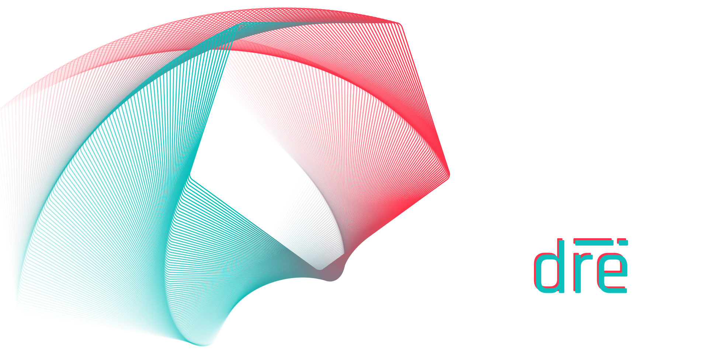

<!-- Hero Image -->

<!---------------->

<!-- Personal Stats -->

    
:chart_with_upwards_trend: GitHub Stats

     
    
     
     
    

<!-------------------->

<!-- Social Section -->

    
:link: Get in Touch

     
    
    
    
    

<!-------------------->
